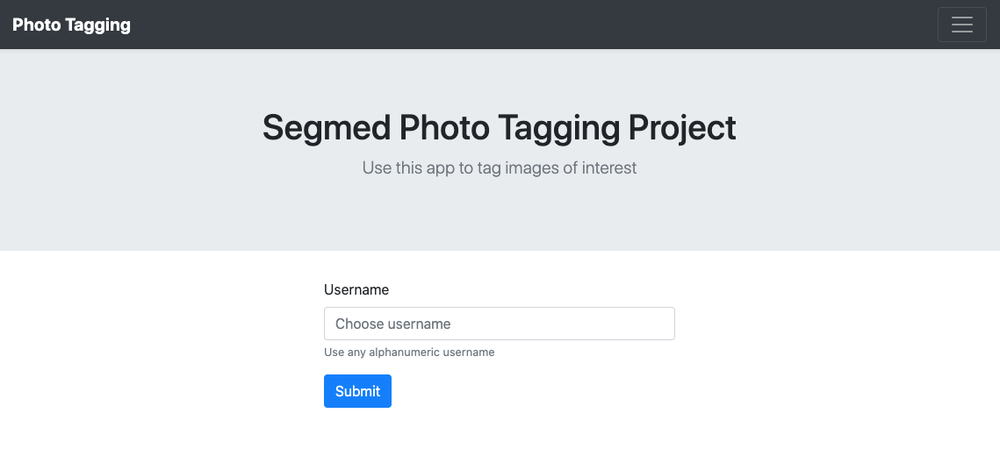
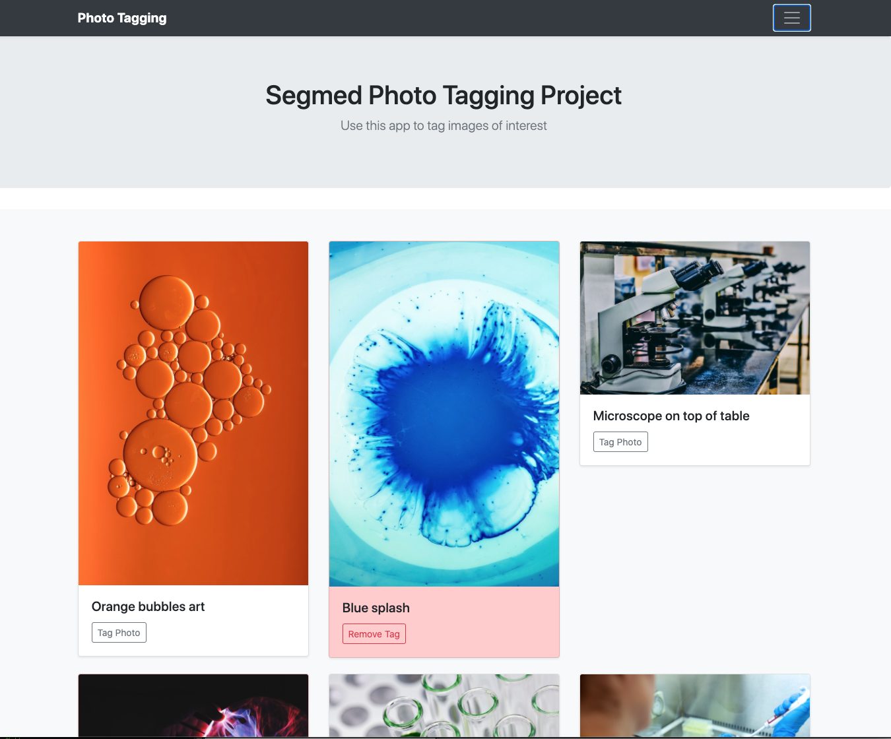

# segmed-project

Response to request for a sample webapp:

> The task is to build a simple web-app. The webapp should display images as its main feature. Think of a simple gallery or a list view. Within the same list view, we'd like to have a "flag" or "tag" button. This button will cause this image to be "remembered" in a DB. In other words: if I reload the page again, I'd like this image to remain flagged/tagged.

## Basic Architecture

The webapp consits of a front-end and back-end. The front-end is react/gatsby and and back-end is Go.

The front-end app is in the frontend directory.

The back-end REST API is in the backend directory.

### Running the app

#### Start the backend REST API

In the backend directory:

```
$ make run
```

The default listen port is 5000. It can be changed with config.json or environment variable `serverPort` setting.

If you change the port on the backend, you must also change the frontend port, as described below.

#### Start the front-end

In the frontend directory:

##### Install the Gatsby CLI

```
$ npm install -g gatsby-cli
```

Install all development libraries:
```
$ npm install
```

##### Environment

You will need to create a `.env.development` file with settings
as follows:

```
GATSBY_API_URL=http://localhost:5000
```

If you ran the REST API on a port other than 5000, change the port to match in
the setting above.

##### Start the development server:

```
$ gatsby develop
```

Open the app in your browser. http://localhost:8000/



When you first connect, you will be prompted for a username. Use the same username to connect in the future to restore your tags.



Click or tap the "Tag Photo" button to tag a photo.

The app shows a photo title as the metadata.